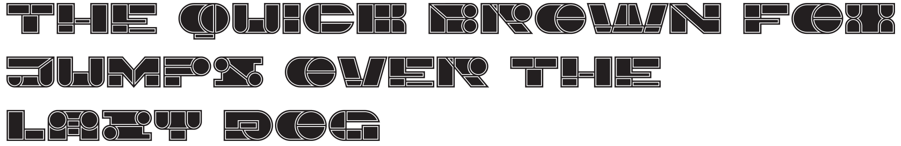

# Imbecile

# Imbecile font

The term imbecile was once used by psychiatrists to denote a category of people 
with moderate to severe intellectual disability, as well as a type of criminal.

## Variable Font Axe

Imbecile has the following axe:

Axis | Tag | Default | Static Instances
--- | --- | --- | ---
Weight | wght | 400 | Regular

## License

This Font Software is licensed under the SIL Open Font License, Version 1.1.
This license is available with a FAQ at [https://openfontlicense.org](https://openfontlicense.org)
